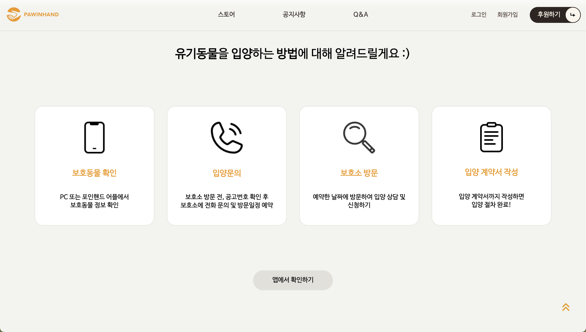

# 포인핸드 홈페이지 리뉴얼 작업
Link: [유기동물 입양 홈페이지로 리뉴얼](https://hyunji1117.github.io/Stray-animal-adoption-website/, "바로가기")  
Link: [포인핸드 기존 공식 홈페이지](https://pawinhand.kr/index.html, "바로가기")

##### 참여자: 김현지, 박** (팀 프로젝트)
  
#### 프로젝트 기간: 2024.12.16 ~ 2025.01.16
  
#### 프로젝트 도구

프론트엔드 기술: HTML, CSS, JavaScript  
라이브러리 및 프레임워크: jQuery, Font Awesome, Google Fonts
디자인 및 에셋 관리: Figma (디자인 레이아웃 사용), Assets 폴더 (이미지 및 아이콘 관리)
호스팅: GitHub Pages  
  
#### 사용 언어: HTML5, SCSS (CSS 포함), JavaScript (ES6 이상)  

****
  
## 1.프로젝트 개요
프로젝트명: 포인핸드(Pawinhand) 보호동물 입양 홈페이지  

목적:
- 유기동물 보호 및 입양 문화 확산 (강아지 공장 반대)
- 모바일처럼 웹에서도 유기동물 입양 서비스를 활성화하고자 제작됨.  

주요 기능: 
- 보호동물 소개 및 추천
Page-2에서 카드 레이아웃으로 유기동물 정보 제공, Page-3에서 슬라이더 구성을 통해 추천 입양 동물을 간편하게 탐색 가능.  

- 회원 관리 기능
로그인 페이지: 사용자가 계정으로 사이트에 접근할 수 있도록 로그인 기능 제공.  
아이디/비밀번호 찾기 페이지: 계정 정보 분실 시 복구를 지원하여 사용자 편의성 강화.
회원가입 약관동의 페이지: 회원 가입 전, 서비스 이용약관 및 개인정보 처리방침을 명확히 확인하고 동의할 수 있도록 구성.
회원정보 입력 페이지: 신규 가입 시 필수 정보를 입력받아 사용자 계정을 생성하고, 개인화된 서비스를 제공할 수 있도록 설계.  

- 입양 절차 안내  
Page-4에서 아이콘과 텍스트를 활용해 입양 절차를 간단하고 직관적으로 설명.  

- 공지사항 및 Q&A 제공
네비게이션 메뉴와 Footer에서 공지사항 및 Q&A에 빠르게 접근 가능하도록 배치.  
- 후원 및 스토어 링크 제공

****
  
## 2.프로젝트 배경  

문제 인식:
- 매년 10만 마리 이상의 유기동물이 발생하며, 입양률이 낮음.  
- 유기동물 입양 문화를 더 많은 사람들에게 알리고, 이를 통해 입양 활성화 필요성 제기.
- 새로운 사이트 제작보다 기존 사이트의 사용자 접근성을 개선하는 리뉴얼 작업을 통한 실질적인 변화 창출.

해결 목표:
- 입양 가능한 동물 정보의 빠른 제공과 간편한 UI/UX 제공.
- 사용자 경험을 개선하여 더 많은 사람들이 유기동물 입양에 참여하도록 유도.  

타겟 사용자:
- 유기동물 입양에 관심 있는 일반 사용자.
- 동물 보호소 및 관련 단체. 
  
## 3.프로젝트 진행 과정  

### 3.1.유기동물 입양 홈페이지 제작을 위한 주차별 계획 및 역할 분담 논의

1주차: 목표 및 요구사항 정의
2주차: 레이아웃 구현 및 세부 방향성 논의
3주차: 2주차 디테일 작업 및 새로운 페이지 레이아웃 구현
4주차: 디테일 작업, 크롬/사파리 웹브라우저 테스트, 포트폴리오 문서화 작업  

역할 분담: 
- 김현지  
  ① 회의기록 문서화 (6회) Link: [회의기록](https://github.com/coworkcarrot/seedcollab/issues/24#issue-2786305572)  
  ② github 협업 과정 공부 및 적용 (최종 merge 작업) [최종코드](https://github.com/coworkcarrot/seedcollab.git)  
  ③ 피그마 작업 (page-1,3) [피그마](https://www.figma.com/design/zuXFDLwww3ANNkklHRJaiT/%EC%9E%85%EC%96%91%EB%8F%99%EB%AC%BC-%ED%99%88%ED%8E%98%EC%9D%B4%EC%A7%80-%ED%94%BC%EA%B7%B8%EB%A7%88(by.hyunji)?node-id=17-499&t=y1UrwvsczQbmojvl-1)  
  ④ index.html page-1 1차 레이아웃  
  ⑤ index.html page-3  
  ⑥ sub-page-1 (소개 페이지, 입양 캠페인, 후원 페이지)  
  ⑦ 로그인 페이지, 아이디/비밀번호 찾기 페이지  
  ⑧ 회원가입 약관동의, 회원정보 입력 페이지  

- 박**  
  ① 피그마 메인 작업  
  ② index.html page-1 2차 레이아웃  
  ③ index.html page-2(카드 페이지), page-4(입양절차), footer  
  ④ sub-page-2 (보호동물, 입양후기)  
  ⑤ sub-page-3 (공지사항, QnA)  
  ⑥ 전체 레이아웃 통일 작업  

### 3.2.웹접근성 검증 도구 선정

1차 검증: Chat GPT 4o  
2차 검증: MDN 공식 참고자료 활용  
3차 검증: W3C 웹표준 검사 사이트  

### 3.3.레이아웃  

index 페이지 레이아웃 및 디자인 요소 제작 (피그마):  
- Figma 강좌 수강  
- 레이아웃 통일 작업  

### 3.4.서비스 목적 부합여부 중간 점검
모든 기능 제작 시, 사용자 경험 관점에서 기능의 필요성을 신중히 검토하여 구현  
- Index 페이지의 '후원하기' 버튼  
- Index page-3의 '보호동물 프로필 자세히 보기' 버튼  
- 로그인 및 회원가입 버튼  

****
  
## 4.트러블슈팅
  ### Swiper-Container 스크롤 구현

  #### 4.1.문제 발생

  초기 시도:  
  swiper-container 내부의 프로필 카드들을 스크롤하도록 구현하고자 함.  

  문제:  
  스크롤 시 overflow: hidden 설정으로 인해 프로필 카드가 스크롤 영역 안에서만 보이는 현상 발생.  
  해결을 위해 부모 요소의 overflow 속성을 조정하거나 높이를 확장하려 했으나 실패.  

  원인 분석:  
  swiper-container의 스크롤 동작이 부모 요소의 overflow: hidden과 충돌.  

  #### 4.2.해결 과정  

  다양한 부모 요소 조정 시도:  
  swiper-container의 부모 요소와 상위 구조에 대해 overflow 속성을 조정하고, 높이를 동적으로 변경하려 함.  

  결과:  
  overflow: visible로 변경해도 스크롤 과정에서 카드가 잘리는 문제는 해결되지 않음.  
  swiper-container를 기준으로 수정하는 방식이 레이아웃의 안정성을 크게 저하시킴.  

  접근 방식 변경:  
  swiper-container의 스크롤 동작을 포기하고, 왼쪽 .img-container를 고정하는 방식으로 전환.  
  .swiper-container를 수직 나열하며 페이지 전체가 스크롤되도록 레이아웃을 재구성.  

  최종 구현:  
  .img-container를 position: sticky와 top 값을 활용해 화면에 고정.  
  .swiper-container를 페이지 내에서 수직 스크롤 가능하도록 변경:  

  #### 4.3.결과  

  스크롤 동작:  
  오른쪽 .swiper-container의 프로필 카드가 자연스럽게 위로 스크롤되며 모든 카드가 올라가는 모습이 제대로 보임.  
  왼쪽 .img-container의 이미지가 고정되어 사용자가 스크롤 중에도 계속 보임.  

  최종 레이아웃:  
  프로필 카드가 드래그되어 올라가는 과정에서 콘텐츠(프로필 영역)가 잘리는 문제 해결.  
  스크롤 중에도 프로필 이미지와 내용이 완전히 표시되며 자연스러운 사용자 경험 제공.  

****
  
## 5.레슨런(lessons learned)  

- 반대로 접근하는 발상의 전환:  
index page-3 작성 시 초기에는 swiper-container를 스크롤하도록 고정하려 했으나, 고정 대상을 바꾸는 방식이 더 적합한 해결책이었음.  
문제를 해결하려면 단순히 기존 방법을 반복하는 것보다 구조적 접근 방식을 바꿔보는 것이 중요함.  

## 6.이 외 레슨런
- 중앙 정렬을 정확히 맞춰야 웹 브라우저 간 크로스 브라우징 이슈를 최소화할 수 있음.  
- 프로젝트 마감 전 최소 3~5일의 여유 기간을 확보해 변수 발생에 대응할 수 있도록 해야 함.  
  
****

  

  

  

  

  

  

  

  

  

  
